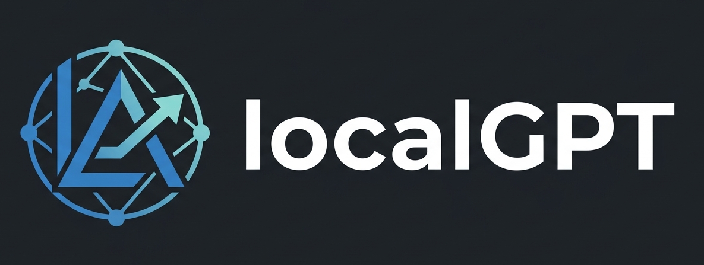

# LocalGPT

LocalGPT is a lightweight, local-first multimodal AI assistant that runs entirely on your PC.

It combines a multimodal VLM with a Python orchestrator and a ChatGPT-like web UI. Image generation and editing capabilities are planned for later phases.

## Creator

Created by Prabir kumar Das

## Features

- Local chat with streaming responses
- Image upload and image understanding via a multimodal VLM
- Conversation persistence
- Dark and light themes, with system detection and persistent choice
- Interface font choice: default system font, Lato, or EB Garamond (bundled locally)
- Responsive, polished UI
- CPU-only operation

## Hardware requirements

- Windows 10/11
- CPU-only
- Optimized for modest hardware such as an Intel i3 3rd Gen with 10 GB RAM, but it can run on stronger systems too

## Supported models

- Multimodal: SmolVLM2 2.2B (primary), Qwen3-VL 2B (alternative)
- Image generation: SD Turbo / LCM-style pipeline (Phase 2)

## Installation

1. Install Python 3.11+
2. Install dependencies:

```
python -m pip install -r requirements.txt
```

3. Install llama.cpp / llama-server for CPU (see docs/setup.md)

## First run

1. Download the models and create `.env` automatically:

```
python model_download.py
```

This downloads the configured VLM (SmolVLM2 2.2B by default) into `models/`, then copies `.env.example` to `.env` with `VLM_MODEL` and `VLM_MODEL_PATH` pre-filled. Use `--model qwen3-vl-2b` to download the alternative model instead, or `--dry-run` to preview.

2. Start llama-server with the downloaded model and run the app:

```
python run_localgpt.py
```

3. Open `http://127.0.0.1:8000`

## Configuration

See `.env.example` and `docs/configuration.md`.

## Running the server

```
python run_localgpt.py
```

## Image generation

CPU-only image generation can be slow. Do not expect instant results. This feature is implemented in Phase 2.

## Image editing

Support for image-to-image, inpainting, and local modifications is planned for Phase 2.

## Troubleshooting

See `docs/troubleshooting.md`.

## Performance expectations

Text chat performance depends on llama-server and the selected quantized model. Image generation on CPU is lightweight but can be slow.

## Privacy

LocalGPT is local-first. By default there are no cloud AI APIs, telemetry, or automatic uploads.

## Project structure

```
LocalGPT/
├── app/                  # FastAPI backend, templates, static assets
│   ├── api/              # HTTP endpoints (chat, conversations, images, system)
│   ├── core/             # Router, resource manager, security, logging
│   ├── inference/        # llama-server client and VLM adapter
│   ├── models/           # SQLite database and Pydantic schemas
│   ├── services/         # Chat, upload, conversation, image services
│   ├── static/           # CSS, JS, vendor libraries, icons
│   └── templates/        # Server-rendered HTML (base, chat, settings)
├── docs/                 # Documentation
├── tests/                # Unit and integration tests
├── data/                 # Runtime data (created on first run)
├── model_download.py     # One-time model downloader + .env setup
├── run_localgpt.py       # Application launcher
└── requirements.txt
```

## Documentation

- `docs/architecture.md`
- `docs/setup.md`
- `docs/api.md`
- `docs/configuration.md`
- `docs/models.md`
- `docs/inference.md`
- `docs/image-generation.md`
- `docs/image-editing.md`
- `docs/ui.md`
- `docs/troubleshooting.md`
- `docs/performance.md`
- `docs/contributing.md`
- `docs/development.md`

## License

MIT — see [LICENSE](LICENSE).
